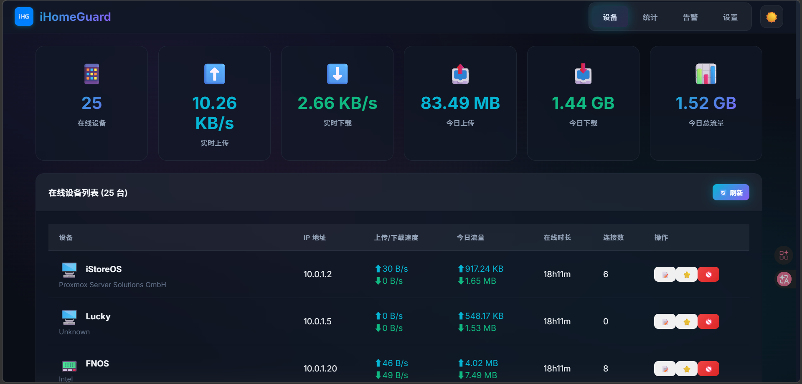
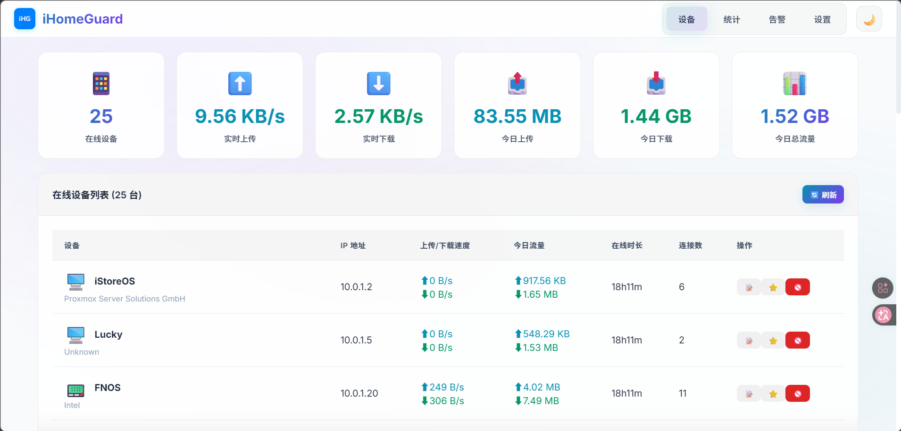
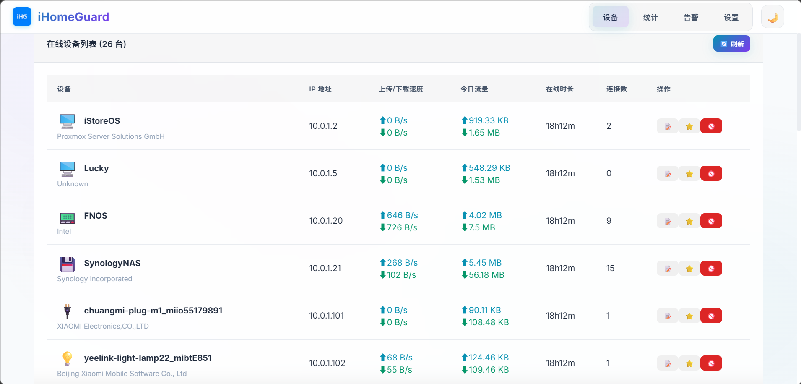
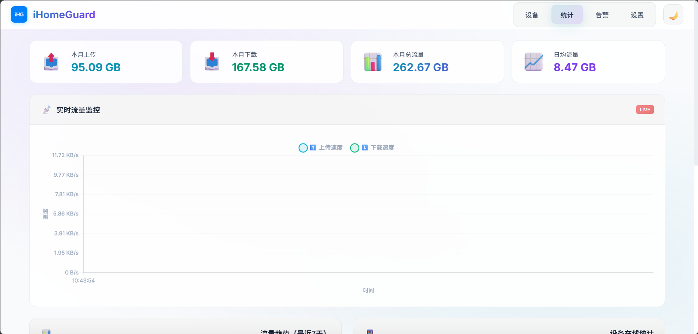
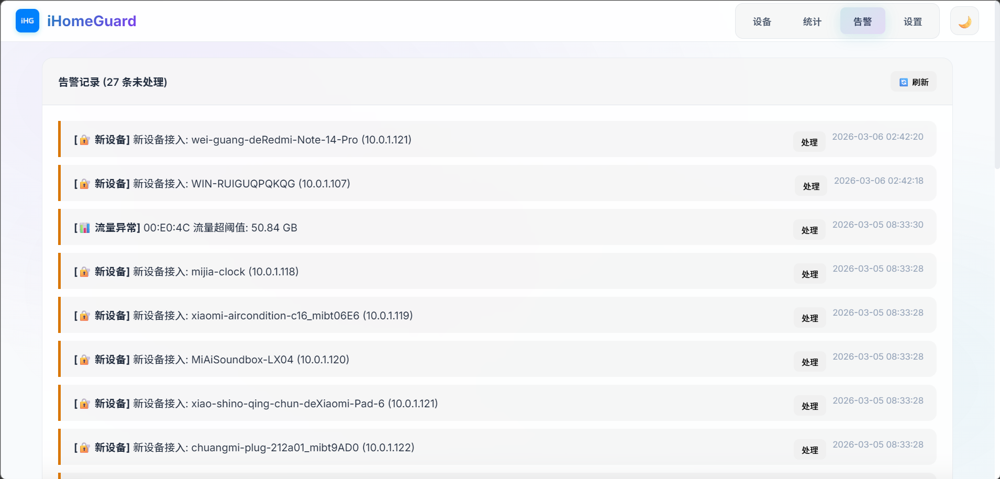
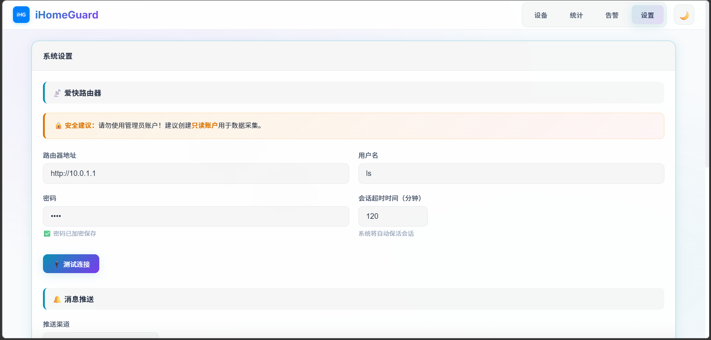

<div align="center">
  
  
  
  # iHomeGuard
  
  **爱快家庭网络卫士**
  
  <i>一个现代化的家庭网络监控与管理工具</i>
  
  [](https://www.python.org/)
  [](https://flask.palletsprojects.com/)
  [](https://www.docker.com/)
  [](LICENSE)
  [](https://github.com/MuskCheng/ihomeguard/stargazers)
  
  [功能特性](#-功能特性) • [快速开始](#-快速开始) • [截图预览](#-截图预览) • [配置说明](#-配置说明) • [API文档](#-api-文档)
  
</div>

---

## 📖 简介

**iHomeGuard** 是一个基于 [爱快路由器](https://www.ikuai8.com/) 的家庭网络监控工具，专为个人家庭用户设计。通过现代化的 Web 界面，帮助您实时掌握家庭网络状态，智能检测异常设备，并在重要事件发生时及时推送通知。

### ✨ 核心亮点

- 🎨 **现代化 UI** - 炫酷的深色/浅色主题，响应式设计适配各种设备
- 📱 **实时监控** - 实时查看在线设备、流量速度、连接数
- 📊 **数据可视化** - 流量趋势图表、设备统计、流量预测
- 🚨 **智能告警** - 新设备检测、设备离线、流量异常告警
- 📬 **多渠道推送** - 支持 PushMe、企业微信、钉钉
- 🔐 **安全存储** - 敏感数据加密存储，保护隐私安全

---

## 🚀 功能特性

<table>
<tr>
<td width="50%">

### 📱 设备监控
- 实时在线设备列表
- 设备流量速度监控
- 设备连接数统计
- 设备厂商识别
- 智能设备图标
- 信任设备标记
- 在线时长统计

</td>
<td width="50%">

### 📊 流量统计
- 实时流量图表
- 7天流量趋势
- 设备在线统计
- 月度流量预测
- 今日流量汇总
- 历史数据查询

</td>
</tr>
<tr>
<td width="50%">

### 🚨 智能告警
- 新设备接入告警
- 信任设备离线告警
- 流量异常告警
- 长时间在线告警
- 告警记录管理
- 一键处理告警

</td>
<td width="50%">

### 📬 消息推送
- PushMe 推送
- 企业微信机器人
- 钉钉机器人
- 每日网络日报
- 实时告警通知
- 推送测试功能

</td>
</tr>
</table>

---

## 📸 截图预览

<div align="center">
  
| 深色模式 | 浅色模式 |
|:---:|:---:|
|  |  |

| 设备列表 | 流量统计 |
|:---:|:---:|
|  |  |

| 告警管理 | 系统设置 |
|:---:|:---:|
|  |  |

</div>

---

## 🛠️ 快速开始

### 方式一：Docker 部署（推荐）

```bash
# 1. 克隆项目
git clone https://github.com/MuskCheng/ihomeguard.git
cd ihomeguard

# 2. 使用 Docker Compose 启动
docker compose up -d

# 3. 访问 Web 界面
# http://localhost:8680
```

### 方式二：本地运行

```bash
# 1. 克隆项目
git clone https://github.com/MuskCheng/ihomeguard.git
cd ihomeguard

# 2. 安装依赖
pip install -r requirements.txt

# 3. 启动服务
python app.py

# 4. 访问 Web 界面
# http://localhost:8680
```

### 首次配置

1. 打开浏览器访问 `http://localhost:8680`
2. 点击右上角「设置」进入配置页面
3. 填写爱快路由器地址和只读账户信息
4. 点击「测试连接」验证配置
5. 配置推送渠道（可选）
6. 点击「保存设置」

---

## ⚙️ 配置说明

### 爱快路由器配置

| 配置项 | 说明 | 示例 |
|--------|------|------|
| 路由器地址 | 爱快路由器管理地址 | `http://192.168.1.1` |
| 用户名 | 只读账户用户名 | `monitor` |
| 密码 | 只读账户密码 | `your_password` |

> ⚠️ **安全建议**：请勿使用管理员账户！建议创建只读账户用于数据采集。

### 推送渠道配置

| 渠道 | 配置项 | 获取方式 |
|------|--------|----------|
| PushMe | Push Key | [PushMe 官网](https://push.i-i.me/) |
| 企业微信 | Webhook 地址 | 企业微信群机器人设置 |
| 钉钉 | Webhook + 密钥 | 钉钉群机器人设置 |

### 监控参数配置

| 参数 | 默认值 | 说明 |
|------|--------|------|
| 采集间隔 | 300秒 | 数据采集频率 |
| 日报时间 | 21:00 | 每日推送时间 |
| 流量告警阈值 | 10GB | 单设备日流量告警 |
| 长在线阈值 | 24小时 | 设备连续在线告警 |

---

## 📁 项目结构

```
ihomeguard/
├── 📄 app.py                 # 应用入口
├── 📄 config.py              # 配置管理
├── 📄 storage.py             # 数据存储层
├── 📄 scheduler.py           # 定时任务调度
├── 📄 requirements.txt       # Python 依赖
├── 📄 Dockerfile             # Docker 构建文件
├── 📄 docker-compose.yml     # Docker Compose 配置
├── 📂 clients/               # API 客户端
│   └── 📄 ikuai_local.py     # 爱快路由器 API
├── 📂 services/              # 业务服务层
│   ├── 📄 monitor.py         # 监控服务
│   ├── 📄 alerter.py         # 告警检测
│   ├── 📄 reporter.py        # 日报生成
│   ├── 📄 pusher.py          # 推送服务
│   └── 📄 vendor.py          # 设备厂商查询
├── 📂 web/                   # Web 层
│   ├── 📄 routes.py          # API 路由
│   ├── 📂 static/            # 静态资源
│   └── 📂 templates/         # HTML 模板
├── 📂 data/                  # 数据目录
└── 📂 config/                # 配置目录
```

---

## 🔌 API 文档

### 设备相关

| 接口 | 方法 | 说明 |
|------|------|------|
| `/api/devices` | GET | 获取在线设备列表 |
| `/api/devices/all` | GET | 获取所有设备（含离线） |
| `/api/device/<mac>/alias` | POST | 设置设备备注/信任 |
| `/api/device/<mac>/kick` | POST | 踢设备下线 |
| `/api/device/<mac>/events` | GET | 获取设备事件历史 |

### 统计相关

| 接口 | 方法 | 说明 |
|------|------|------|
| `/api/stats/today` | GET | 获取今日统计 |
| `/api/stats/week` | GET | 获取近7天统计 |
| `/api/stats/prediction` | GET | 获取流量预测 |

### 告警相关

| 接口 | 方法 | 说明 |
|------|------|------|
| `/api/alerts` | GET | 获取未处理告警 |
| `/api/alert/<id>/resolve` | POST | 处理告警 |

### 系统相关

| 接口 | 方法 | 说明 |
|------|------|------|
| `/api/config` | GET | 获取配置 |
| `/api/config` | POST | 保存配置 |
| `/api/test/ikuai` | POST | 测试爱快连接 |
| `/api/test/push` | POST | 测试推送 |
| `/api/health` | GET | 健康检查 |

---

## 🔧 技术栈

<p align="center">
  
  
  
  
  
  
</p>

---

## 📝 更新日志

<details>
<summary><b>点击展开更新日志</b></summary>

### v1.0.0 (2026-03-05)
- 🎉 初始版本发布
- ✨ 设备实时监控功能
- ✨ 流量统计与趋势图表
- ✨ 智能告警系统
- ✨ 多渠道消息推送
- ✨ 日间/夜间主题切换
- ✨ 炫酷现代化 UI
- ✨ 数据加密存储

</details>

---

## 🤝 贡献指南

欢迎提交 Issue 和 Pull Request！

1. Fork 本仓库
2. 创建特性分支 (`git checkout -b feature/AmazingFeature`)
3. 提交更改 (`git commit -m 'Add some AmazingFeature'`)
4. 推送到分支 (`git push origin feature/AmazingFeature`)
5. 提交 Pull Request

---

## 📄 开源协议

本项目基于 [MIT](LICENSE) 协议开源。

---

## 🙏 致谢

- [爱快路由器](https://www.ikuai8.com/) - 提供强大的路由器 API
- [Vue.js](https://vuejs.org/) - 渐进式 JavaScript 框架
- [Chart.js](https://www.chartjs.org/) - 灵活的图表库
- [Flask](https://flask.palletsprojects.com/) - 轻量级 Web 框架

---

<div align="center">
  
  **⭐ 如果这个项目对你有帮助，请给一个 Star ⭐**
  
  Made with ❤️ by [MuskCheng](https://github.com/MuskCheng)
  
</div>